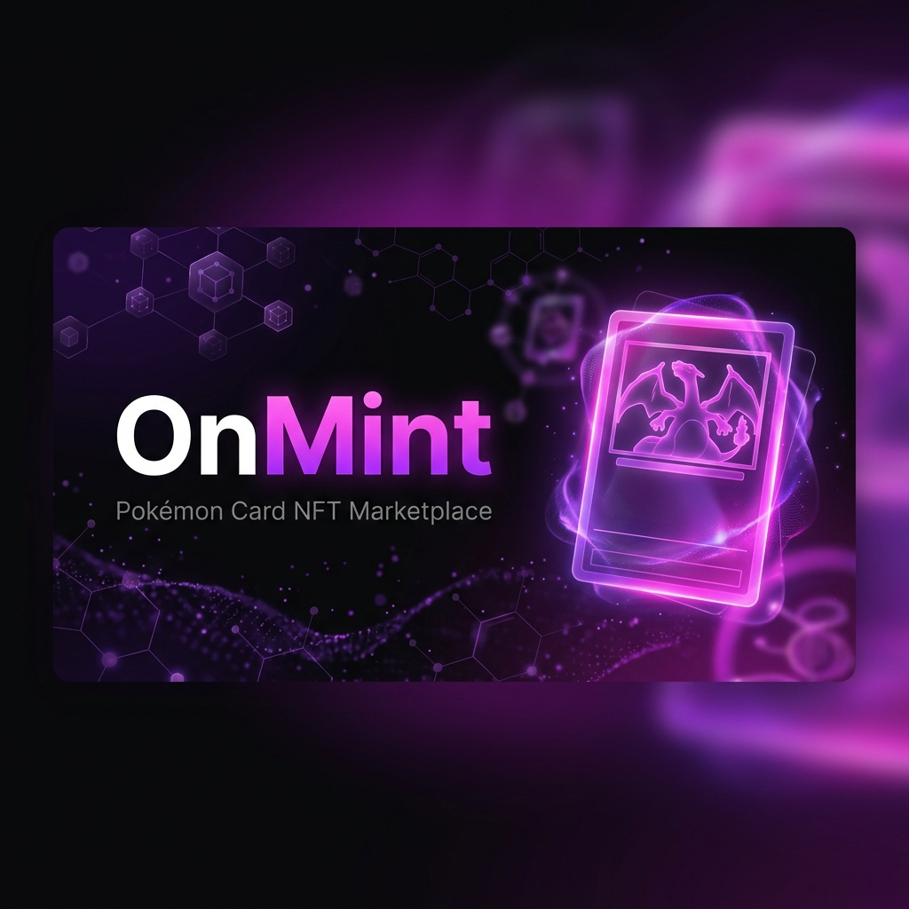

<p align="center">
  
</p>

<p align="center">
  <a href="https://soliditylang.org/"></a>
  <a href="https://getfoundry.sh/"></a>
  <a href="https://react.dev/"></a>
  <a href="https://vitejs.dev/"></a>
  
</p>

<p align="center">
  <strong>OnMint</strong> is a fully on-chain Pokémon Card NFT Marketplace — where you can mint, collect, list, and trade authenticated Pokémon card NFTs with true digital ownership on the Ethereum blockchain.
</p>

---

## ✨ Features

| Feature | Description |
|---|---|
| 🃏 **NFT Minting** | Mint unique Pokémon Cards with metadata (name, rarity, series, card number) stored on-chain and images on IPFS via Pinata |
| 🛒 **Marketplace** | List cards for sale, browse active listings, and purchase cards securely through the smart contract |
| 💎 **Royalties (ERC-2981)** | Automatic royalty payments to the original creator on every secondary sale |
| 💼 **Batch Minting** | Admin can mint multiple cards in a single transaction for efficiency |
| 🔗 **Wallet Connect** | Seamless Web3 sign-in experience via RainbowKit (MetaMask, WalletConnect, Coinbase Wallet & more) |
| 👤 **User Collections** | View your owned NFT cards in a personalized collections page |
| 🛡️ **Admin Panel** | Privileged admin dashboard for minting new cards and managing platform settings |
| 📐 **Platform Fees** | Configurable platform fee (default 2.5%) on all marketplace sales |

---

## 🏗️ Architecture

```
OnMint/
├── 📁 assets/                    # Project assets (banner, images)
├── 📁 frontend/
│   └── OnMint/
│       └── src/
│           ├── 📁 components/    # Reusable UI components
│           │   ├── CardComponent.tsx
│           │   ├── MintProgressBar.tsx
│           │   ├── Navbar.tsx
│           │   └── PokemonCardItem.tsx
│           ├── 📁 pages/         # Application pages
│           │   ├── LandingPage.tsx
│           │   ├── Marketplace.tsx
│           │   ├── CollectionsPage.tsx
│           │   ├── AdminPage.tsx
│           │   ├── CardDetail.tsx
│           │   └── Profile.tsx
│           ├── 📁 contracts/     # ABI & contract addresses
│           ├── 📁 hooks/         # Custom React hooks (wagmi wrappers)
│           └── 📁 utils/         # Utility helpers
└── 📁 smart-contract/
    ├── 📁 src/
    │   ├── PokemonCard.sol        # ERC-721 + ERC-2981 NFT contract
    │   └── PokemonMarketplace.sol # Marketplace contract
    ├── 📁 script/                 # Foundry deployment scripts
    └── 📁 test/                   # Forge unit tests
```

---

## 🔗 Smart Contracts

### `PokemonCard.sol`
> ERC-721 NFT contract with on-chain metadata and royalty support.

| Function | Access | Description |
|---|---|---|
| `mintCard(to, tokenURI, data)` | Owner only | Mint a single Pokémon card NFT |
| `batchMintCard(to[], tokenURIs[], data[])` | Owner only | Batch mint multiple cards in one tx |
| `setDefaultRoyalty(receiver, fee)` | Owner only | Update the platform-wide royalty fee |
| `setTokenRoyalty(tokenId, receiver, fee)` | Owner only | Override royalty for a specific token |
| `totalSupply()` | Public | Returns total number of minted cards |

- **Token Standard**: ERC-721 with `ERC721URIStorage`
- **Royalties**: ERC-2981 (default **5%**)
- **Metadata**: Each token stores `name`, `rarity`, `series`, and `cardNumber` on-chain

### `PokemonMarketplace.sol`
> Decentralized marketplace for listing and trading Pokémon Card NFTs.

| Function | Access | Description |
|---|---|---|
| `listCard(tokenId, price)` | Card Owner | List a card for sale at a given price (in wei) |
| `buyCard(tokenId)` | Public (payable) | Purchase an active listing |
| `cancelListing(tokenId)` | Seller | Cancel your active listing |
| `updatePrice(tokenId, newPrice)` | Seller | Update the price of your active listing |
| `withdrawFees()` | Owner only | Withdraw accumulated platform fees |
| `setPlatformFee(newFee)` | Owner only | Update the platform fee (basis points) |

- **Platform Fee**: 2.5% (250 basis points) — configurable by owner
- **Royalties**: Automatically distributed to the royalty receiver on every sale
- **Security**: Uses `ReentrancyGuard` to prevent reentrancy attacks
- **Payment flow**: `sale price → platform fee + royalty fee → seller receives the rest`

---

## 🖥️ Tech Stack

### Smart Contracts
| Tool | Purpose |
|---|---|
| [Solidity ^0.8.28](https://soliditylang.org/) | Smart contract language |
| [Foundry](https://getfoundry.sh/) | Build, test, and deploy toolchain |
| [OpenZeppelin Contracts](https://openzeppelin.com/contracts/) | Battle-tested ERC-721, ERC-2981, Ownable, ReentrancyGuard |

### Frontend
| Tool | Purpose |
|---|---|
| [React 19](https://react.dev/) | UI framework |
| [TypeScript](https://www.typescriptlang.org/) | Type-safe JavaScript |
| [Vite](https://vitejs.dev/) | Lightning-fast build tool |
| [Tailwind CSS v4](https://tailwindcss.com/) | Utility-first CSS framework |
| [Wagmi](https://wagmi.sh/) | React hooks for Ethereum |
| [Viem](https://viem.sh/) | TypeScript Ethereum client |
| [RainbowKit](https://www.rainbowkit.com/) | Wallet connection UI |

### Storage
| Tool | Purpose |
|---|---|
| [Pinata](https://pinata.cloud/) | IPFS pinning service for card images & metadata |

---

## 🚀 Getting Started

### Prerequisites

Make sure you have the following installed:

- [Node.js](https://nodejs.org/en/) **v18+**
- [Foundry](https://getfoundry.sh/) (`forge`, `cast`, `anvil`)
- A Web3 wallet (e.g., [MetaMask](https://metamask.io/))

---

### 1. Clone the Repository

```bash
git clone https://github.com/your-username/OnMint.git
cd OnMint
```

---

### 2. Smart Contract Setup

```bash
cd smart-contract
```

**Install dependencies:**
```bash
forge install
```

**Compile contracts:**
```bash
forge build
```

**Run tests:**
```bash
forge test
```

**Deploy to a local Anvil node:**
```bash
# Terminal 1 — start local node
anvil

# Terminal 2 — run deployment script
forge script script/Deploy.s.sol --rpc-url http://localhost:8545 --broadcast
```

---

### 3. Frontend Setup

```bash
cd frontend/OnMint
```

**Install dependencies:**
```bash
npm install
```

**Configure environment variables:**

Create a `.env` file in `frontend/OnMint/` and add the following:

```env
VITE_WALLETCONNECT_PROJECT_ID=your_walletconnect_project_id
VITE_PINATA_API_KEY=your_pinata_api_key
VITE_PINATA_SECRET_API_KEY=your_pinata_secret_key
VITE_POKEMON_CARD_ADDRESS=0xYourDeployedContractAddress
VITE_MARKETPLACE_ADDRESS=0xYourDeployedMarketplaceAddress
```

> **Where to get these keys:**
> - **WalletConnect Project ID** → [cloud.walletconnect.com](https://cloud.walletconnect.com)
> - **Pinata API Keys** → [app.pinata.cloud](https://app.pinata.cloud)
> - **Contract Addresses** → from your Foundry deployment output

**Start the development server:**
```bash
npm run dev
```

Open your browser and navigate to **[http://localhost:5173](http://localhost:5173)** 🎉

---

## 🃏 How It Works

```
1. Admin mints Pokémon Card NFTs via the Admin Panel
      ↓ (card metadata + IPFS image URI stored on-chain)

2. Owner lists their card on the Marketplace
      ↓ (approve marketplace, set price in ETH)

3. Buyer purchases the listed card
      ↓ (ETH payment split: platform fee + royalty + seller proceeds)

4. Buyer receives the NFT on-chain
      ↓ (viewable in My Collections page)
```

---

## 🛡️ Security Considerations

- **Reentrancy Guard**: All ETH transfers in `buyCard` are protected via OpenZeppelin's `ReentrancyGuard`.
- **Checks-Effects-Interactions**: The marketplace follows the CEI pattern — state is updated before external calls.
- **Custom Errors**: Gas-efficient custom errors are used throughout instead of `require` strings.
- **Royalty Handling**: Royalty calls are wrapped in a `try/catch` to prevent reverting when the NFT doesn't implement ERC-2981.
- **Ownership**: Admin-only functions are protected by OpenZeppelin's `Ownable`.

---

## 🧪 Running Tests

```bash
cd smart-contract
forge test -vvv
```

For gas reporting:
```bash
forge test --gas-report
```

---

## 📋 Rarity Tiers

| Rarity | Pull Rate |
|---|---|
| ⚪ Common | 1 in 10 |
| 🟢 Uncommon | 1 in 50 |
| 🔵 Rare | 1 in 200 |
| 🟡 Ultra Rare | 1 in 5,000 |

---

## 📄 License

This project is licensed under the **MIT License** — see the [LICENSE](LICENSE) file for details.

---

<p align="center">
  Made with ❤️ by the OnMint team · <em>Where Legends Are Minted.</em>
</p>
